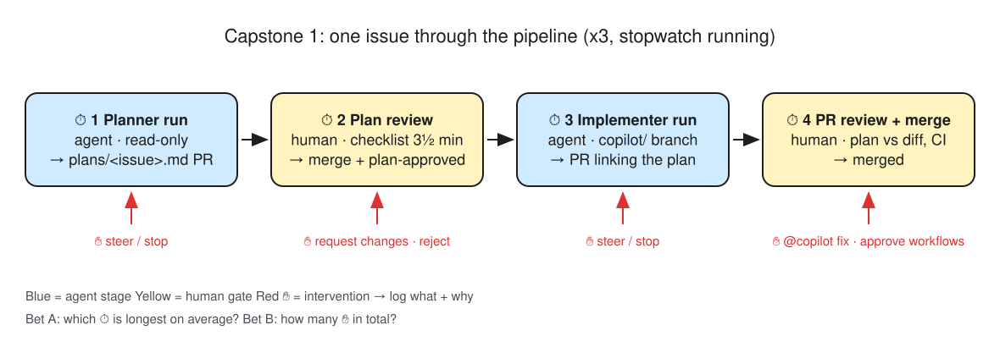
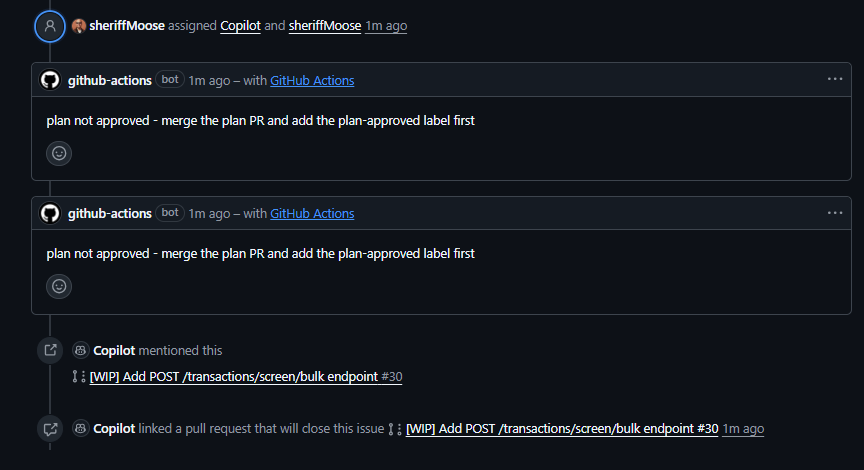
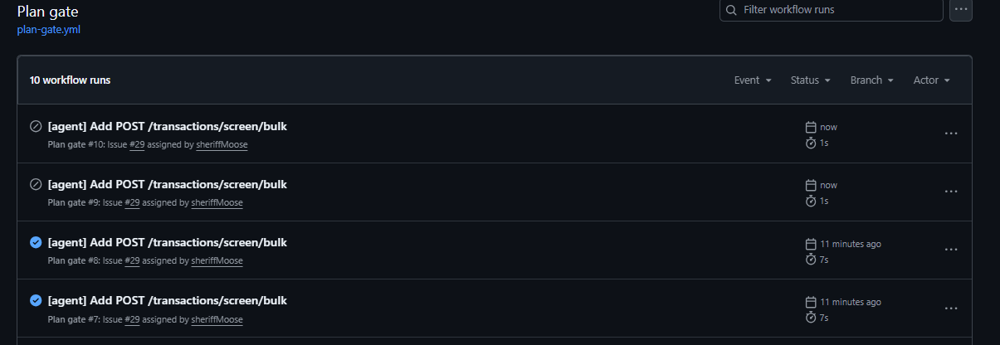
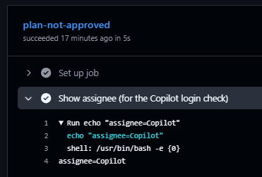
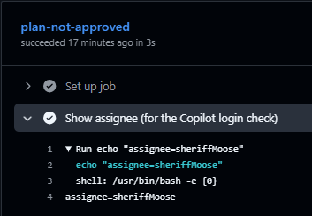
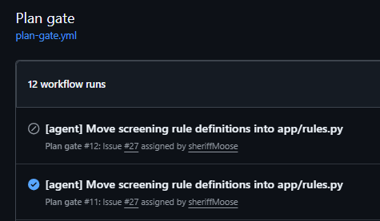
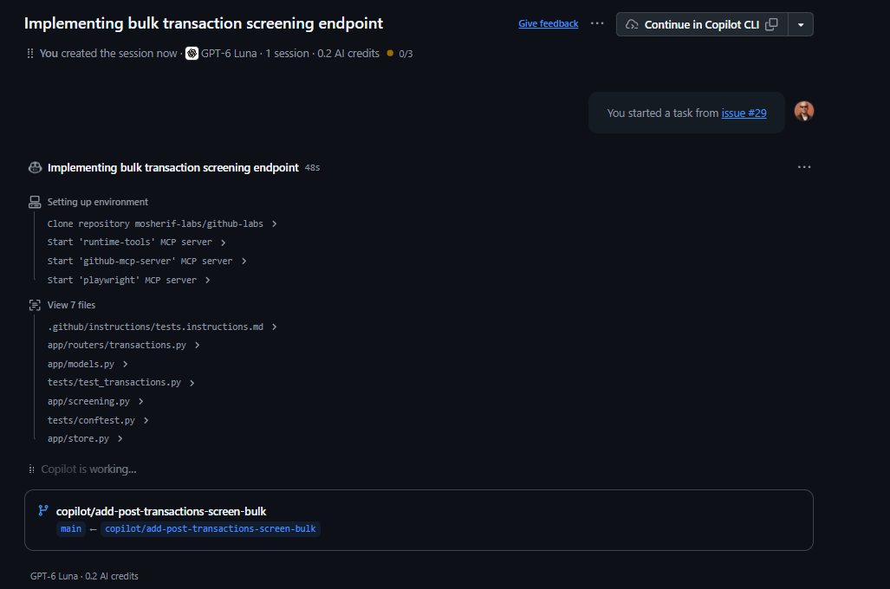
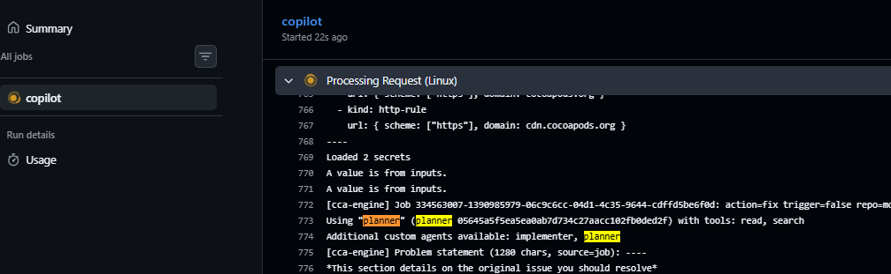
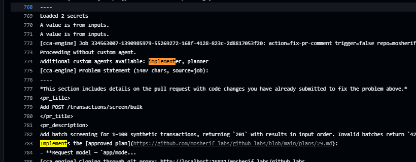

# Day 6 — Capstone 1: plan → approve → execute, three times

> Three real issues go through the whole pipeline you built this week, with a stopwatch running. Where does the time go, and **where did you have to step in?**

**Deliverable:** 3 merged PRs, each linking its approved plan · this file with timings and interventions · Learn module 2 finished

*Source: [`img/d06-pipeline.excalidraw`](img/d06-pipeline.excalidraw), open it in excalidraw.com to edit*

## Bets

- **Bet A**: Averaged over the 3 issues, which stage takes the **most wall-clock time**? (Planner run · My plan review · Implementer run · My PR review + merge) **My guess: My PR review + merge**
  - Result: **Miss**: actual **My plan review** (7.7 min avg) > PR review (5.5) > planner (3.1) > implementer (2.4). The plan review is where every real catch happened (3 of 3 plans changed), and it includes the manual copy-to-PR step
- **Bet B**: Total interventions (steer, fix a plan, request changes) across the 3 issues. **My guess: 4** (win if within ±2)
  - Result: **Hit**: actual **5** (3 plan fixes, 1 planner rerun, 1 `@copilot` evidence round). Not counted: branch updates before merge, and evidence I added myself at review

## Timings

Clock rules: **start** when you click *Assign* / open the PR, **stop** when the stage's output is ready for the next stage (plan PR open · plan merged + `plan-approved` · implementer PR marked ready · PR merged). Minutes, rounded.

**PR review + merge** is timed from when I **start reviewing** (#32: queued 17:42 → review started 18:24 UTC = 42 min queue), not from when the PR became ready: following the plan, PRs wait until Missions 6–7, and that queue time isn't review effort. Queue time noted separately.

| # | Issue | Planner run | Plan review | Implementer run | PR review + merge | Total | Interventions (what + why) |
|---|---|---|---|---|---|---|---|
| 1 | [#29](https://github.com/mosherif-labs/github-labs/issues/29) new endpoint | 1.0 (run 57 s, [screenshot](img/d06-i1-planner-run.png)) | 10.2 (incl. agent-identity detour + manual copy) | 2.5 (run 2 m 19 s, [screenshot](img/d06-i1-implementer-run.png)) | 5.1 (queued 42 min first) | **18.8** | 2: plan §3 upper bound · PR evidence `@copilot` |
| 2 | [#27](https://github.com/mosherif-labs/github-labs/issues/27) refactor | 7.2 (failed run 1 m 1 s + rerun 53 s, [screenshot](img/d06-i2-planner-run.png)) | 6.1 | 2.3 (session 2 m 5 s) | 8.0 (update branch, CI, evidence + §4 comment, merge hand-off) | **23.6** | 2: planner rerun · plan §3/§4 pin all values |
| 3 | [#28](https://github.com/mosherif-labs/github-labs/issues/28) test coverage | 1.0 (session 56 s) | 6.8 | 2.5 (session 1 m 53 s) | 3.4 (overlapped with #37) | **13.7** | 1: plan §3 drop duplicate tests |
| | **Average** | **3.1** | **7.7** | **2.4** | **5.5** | **18.7** | **Total: 5** |

Source: issue and PR timelines via the GitHub REST API (UTC). Stage boundaries: **planner** = Copilot assigned → session finished · **plan review** = session finished → implementer assigned (includes copying the plan, checklist review, fix commit, plan PR, merge, label) · **implementer** = assigned → review requested · **PR review** = I start reviewing → merged (queue time excluded).

| Stage | Agent time (sum of runs) | Human / wall-clock time (avg) |
|---|---|---|
| Planner | 57 s · 1 m 54 s · 56 s | 3.1 min, of which #27's failure + recovery is 6 min |
| Implementer | 2 m 19 s · 2 m 5 s · 1 m 53 s | 2.4 min |
| Plan review | none | **7.7 min** |
| PR review | 1 m (one evidence round) | 5.5 min |

Intervention log (one line each, so the reasons don't get squeezed into the table):

| # | Issue | Stage | What I did (steer / edit plan / request changes / `@copilot` comment / rerun) | Why |
|---|---|---|---|---|
| 1 | #29 | Plan review | Added `test_screen_bulk_accepts_100_transactions` to *Tests to add* (commit on `plans/29`), with a PR comment citing §3 | Plan tested 101 → 422 but never that 100 is accepted: an off-by-one (`max_length=99`) would pass every planned test |
| 2 | #27 | Planner run | Re-ran the planner unchanged (closed the WIP draft, unassigned + reassigned Copilot with `planner`, empty prompt) | Session failed after 1 m 1 s: "Failed to get a valid PR summary after 3 attempts", no plan in the log. Learn safe iteration: rerun once; same failure twice → escalate ([screenshot](img/d06-i2-planner-error.png)) |
| 3 | #27 | Plan review | Commit `410ad41` on `plans/27`: test pins **all six** moved definitions; *Risks* names the `watchlist.py` caller and states "no effect on decisions" + proof; rollback records the unmet second-reviewer rule | §3 + §4 Escalate: plan pinned only `RULES` + `REVIEW_THRESHOLD`; existing tests use 7600.10 / 8000 / 9000, so a silently changed `LARGE_AMOUNT` would pass every test |
| 4 | #28 | Plan review | Commit on `plans/28`: dropped 4 planned tests that duplicate existing ones (listed as "already covered"), split the 3-letter country test per field, implementer lists `xfail` bugs in the PR (it can't open issues) | §3: 5 of 11 planned tests already existed; `test_same_high_risk_country_on_both_sides_counts_once` reused an **existing name** in the same module, which would silently replace the original. My issue draft caused part of it; the planner (read + search) didn't check either |
| 5 | #29 / PR #32 | PR review | `@copilot` comment: add the CI run link + pytest output from the plan's *Evidence to attach* | PR description had neither; `implementer.agent.md` only knows the old six sections, so *Evidence to attach* isn't enforced |

## Mission 1 — Three issues

Agent-task form fields: Context · Inputs · Expected output · Acceptance criteria · Out of scope · Test expectations. Synthetic data only.

<b>Issue 1 draft — new endpoint: <code>POST /transactions/screen/bulk</code></b>

- **Title:** `[agent] Add POST /transactions/screen/bulk`
- **Context:** Analysts replay batches of synthetic transactions; today each needs its own `POST /transactions/screen` call.
- **Inputs:** `app/routers/transactions.py` (`screen_transaction`), `app/models.py` (`TransactionIn`, `ScreeningResult`), `app/screening.py` (`screen`).
- **Expected output:** `POST /transactions/screen/bulk` takes `{"transactions": [TransactionIn, ...]}` (1–100 items) and returns `201` with a list of `ScreeningResult` in input order; each item is stored and raises an alert exactly as the single endpoint does.
- **Acceptance criteria:** empty list → `422`; 101 items → `422`; one invalid item → `422` and **nothing stored**; results reuse `screen()` (no duplicated rule logic); `GET /transactions/{id}` works for every returned id.
- **Out of scope:** changes to `RULES`, scores or thresholds; the single-transaction endpoint; `infra/`; `.github/`.
- **Test expectations:** tests in `tests/test_transactions.py` for: 3-item batch (one review, two clear) → correct decisions + 1 alert; order preserved; empty → 422; 101 → 422; one bad item → 422 and store unchanged.

<b>Issue 2 draft — refactor: move rules into <code>app/rules.py</code></b>

- **Title:** `[agent] Move screening rule definitions into app/rules.py`
- **Context:** `app/screening.py` mixes rule definitions (thresholds, `RULES`, scores) with the matching logic, so a threshold change and a logic change land in the same file and review.
- **Inputs:** `app/screening.py`, `tests/test_screening.py`.
- **Expected output:** `HIGH_RISK_COUNTRIES`, `LARGE_AMOUNT`, `ROUND_AMOUNT_STEP`, `NAME_MATCH_THRESHOLD`, `REVIEW_THRESHOLD`, `RULES` move **unchanged** to `app/rules.py`; `app/screening.py` imports them. Pure move: no value, score or behaviour changes.
- **Acceptance criteria:** every constant has the same value; all existing tests pass unmodified; `screen()` signature unchanged; no other callers change.
- **Out of scope:** changing any threshold, score or rule; renaming rules; `infra/`; `.github/`.
- **Test expectations:** a new test asserting `app.rules` exposes the same rule ids/scores as before (`WATCHLIST_NAME 70`, `HIGH_RISK_COUNTRY 40`, `LARGE_AMOUNT 20`, `ROUND_AMOUNT 10`) and `REVIEW_THRESHOLD == 50`.
- ⚠️ Checklist §4: touches screening rules in `app/screening.py` → **Escalate**. *Risks* must say decisions don't change and how that's proven (same tests, same scores). Solo repo: note how you handled the second reviewer.

<b>Issue 3 draft — test coverage: amount + country validation edges</b>

- **Title:** `[agent] Add edge-case tests for amount and country validation`
- **Context:** `TransactionIn` validates amount (`> 0`, 2 decimal places), currency (`^[A-Z]{3}$`) and countries (`^[A-Z]{2}$`), and the rules fire at `LARGE_AMOUNT = 7500` and multiples of `1000`, but the boundaries aren't all tested.
- **Inputs:** `app/models.py`, `app/screening.py`, `tests/test_transactions.py`, `tests/test_screening.py`.
- **Expected output:** tests only. No changes under `app/`.
- **Acceptance criteria:** amount `0` and negative → 422; `0.001` (3 dp) → 422; `7499.99` → no `LARGE_AMOUNT`; `7500.00` → `LARGE_AMOUNT`; `1000` → `ROUND_AMOUNT`, `999.99` → none; lowercase / 3-letter country (`xq`, `XQZ`) → 422; high-risk country on beneficiary only still hits `HIGH_RISK_COUNTRY`, same country on both sides → one hit.
- **Out of scope:** any change under `app/`; `infra/`; `.github/`. If a test exposes a bug, **mark it `xfail` and open a new issue**, don't fix it here.
- **Test expectations:** each acceptance line is its own named test (parametrize allowed).

## Missions 2–5 — Plan → review → implementer

Issues (created 2026-10-03): **#29** endpoint · **#27** refactor · **#28** test coverage. Pipeline order follows the plan (endpoint first), not issue numbers.

Flow per issue (Day 4): assign **planner** → `plans/<issue>.md` in a PR → [`plan-checklist.md`](plan-checklist.md) (target 3½ min) → merge + `plan-approved` → assign **implementer** pointing at the plan.

| Issue | Plan PR | Checklist verdict (lines cited) | Plan merged | Implementer PR | Notes |
|---|---|---|---|---|---|
| 1 | [#31](https://github.com/mosherif-labs/github-labs/pull/31) (`plans/29`) | Request changes §3: 100-item upper bound untested → fixed in `d3720e2`; §4 nit: *Risks* doesn't state "no effect on decisions" in words (accepted) | ✅ `f765a99` + `plan-approved` | [#32](https://github.com/mosherif-labs/github-labs/pull/32) on `copilot/add-post-transactions-screen-bulk-again` | Planner's own draft PR [#30](https://github.com/mosherif-labs/github-labs/pull/30) is an empty shell (`Initial plan` only), to close unmerged |
| 2 | [#36](https://github.com/mosherif-labs/github-labs/pull/36) (`plans/27`: `4b12576` planner + `410ad41` fix) | **Escalate** (§4 screening rules). Request changes §3 + §4: pin all six values, name `watchlist.py` caller, state decision impact. Second reviewer: documented, not met (solo repo) | ✅ `f8a5aa1` + `plan-approved` | [#37](https://github.com/mosherif-labs/github-labs/pull/37) | Planner's log: `Using "planner" (planner 05645a5f…)` = the `main` commit the agent file was loaded from |
| 3 | [#39](https://github.com/mosherif-labs/github-labs/pull/39) (`plans/28`: `498a364` planner + `d547afe` fix) | Request changes §3: duplicated / shadowed existing tests. Checklist gap: no line for "doesn't duplicate an existing test" | ✅ `9a5fdf8` + `plan-approved` | [#40](https://github.com/mosherif-labs/github-labs/pull/40) |  |

## Missions 6–7 — PR review + merge

**Did intervention 3 matter? Mutation check on #37** (local copy of the PR, `uv run pytest`):

| `app/rules.py` | Full suite | Without `test_rules_constants_unchanged` |
|---|---|---|
| As in the PR (`LARGE_AMOUNT = 7500`) | 52 passed | 51 passed |
| `LARGE_AMOUNT = 7000` (silent value change) | **1 failed**, 51 passed | **51 passed**: the change goes unnoticed |

Without the plan fix, the planner's original test would have let a screening-threshold change through a "pure move" refactor.

Check each implementer PR against its plan: *Files to change* = files in the diff? *Tests to add* = tests in the diff? Plan linked in the description? CI green?

| PR | Files match plan | Tests match plan | Plan linked | CI | `@copilot` fix rounds | How the 1-approval rule was satisfied | Merged as |
|---|---|---|---|---|---|---|---|
| 1 [#32](https://github.com/mosherif-labs/github-labs/pull/32) | ✅ exactly the 3 planned files | ✅ all 6 planned tests, incl. the §3 fix `test_screen_bulk_accepts_100_transactions` | ✅ "Implements the [approved plan]" → `plans/29.md` ([screenshot](img/d06-i1-pr32-description.png)) | ✅ 3/3; Evidence added: "CI: run #54, attempt 2 — passed. Pytest output: `57 passed`" (51 + 6 ✅). ⚠️ run named, **not linked** | 1 (evidence only: 1 m 0 s session, **no new commits**, diff unchanged) | No counting approval (my approval doesn't count on a Copilot PR I started; merge box: "No applicable reviews submitted by reviewers with write access"). Unblocked after **Update branch** (`51361b9`, merged `main` in): the branch was behind `main` by #33/#36/#39, so the real blocker was most likely *require branches up to date*, with Required approvals still 0 | `a25afee` |
| 2 [#37](https://github.com/mosherif-labs/github-labs/pull/37) | ✅ `rules.py` (new), `screening.py`, `test_screening.py` | ✅ `test_rules_constants_unchanged` pins all six | ✅ links `plans/27.md` | ✅ `test` + CodeQL on updated head `c105775`; evidence (CI link + mutation check) **added to the description at review**, no agent round | 0 | No counting approval (Required approvals = 0; mine wouldn't count on a Copilot PR I started). Update branch first. Review written as a COMMENT review, merged by me; §4 second reviewer: not met, documented | `c4a3a03` |
| 3 [#40](https://github.com/mosherif-labs/github-labs/pull/40) | ✅ only the 2 test files, no `app/` | ✅ exactly the 8 planned tests; no duplicate names; no `xfail` (no bugs found) | ✅ links `plans/28.md` | ✅ `test` + CodeQL on updated head `edc020b`; evidence (CI link + local 59 passed) **added at review**, no agent round | 0 | No counting approval (Required approvals = 0; mine wouldn't count on a Copilot PR I started). Update branch first. Review written as a COMMENT review, merged by me (updated twice: after #32 and after #37) | `51de93c` |

## Mission 8 — Learn module 2

Sources: [Build reliable workflows — Outputs are workflow contracts](https://learn.microsoft.com/en-us/training/modules/design-agent-architecture-integration/6-reliable-workflows#outputs-are-workflow-contracts-step-outputs-vs-job-outputs-vs-env) · [Control and operate agents — Minimum observability set](https://learn.microsoft.com/en-us/training/modules/design-agent-architecture-integration/7-agent-operations-controls#minimum-observability-set) · [Control and operate agents — Tools, MCP and secrets](https://learn.microsoft.com/en-us/training/modules/design-agent-architecture-integration/7-agent-operations-controls#how-to-control-tools-mcp-integrations-and-secrets-safely)

**Outputs are workflow contracts** (through *Safe triggering and defensive gating*)

- Step outputs → same job (`$GITHUB_OUTPUT`, `steps.<id>.outputs`); job outputs → across jobs via `needs.<job>.outputs`; env vars configure runtime, not structured data flow
- Contexts: `github.*` event metadata, `vars.*` shared config, `env.*` job-level variables
- Defensive gating: job-level `if: github.event_name == 'pull_request'` so PR-only steps don't run on other triggers
- My note:

**Minimum observability set** (through *Safe iteration policy*)

- Minimum set: structured plan · bounded PR + commits · workflow run links for required checks · uploaded artifacts · review outcomes
- Safe iteration: agent may revise and rerun after a failed check; **same required check fails twice → escalate** to a human with what failed, what was tried, evidence and next step
- My note:

**Controlling tools, MCP and secrets**

- Agent profiles give three boundaries: **capability** (allowed tools), **visibility** (user-selectable or not), **delegation** (which subagents, which handoffs)
- Read-only tools for planning/review agents; changes to tool allowlists are governance-sensitive
- No secrets in instruction files, committed config or plain workflow YAML; the agent runtime has its own secret boundary
- My note:

*Skipped: How hooks enforce guardrails and audit logging, back in Week 2 Day 6 (Capstone 2).*

- [ ] Module assessment / Knowledge Check passed: score ___

## Mission 9 — Write-up

**Totals per stage, per issue:** see *Timings*. Slowest stage on average: **plan review, 7.7 min** (PR review 5.5 · planner 3.1 · implementer 2.4). Agent runs were 1–2.3 min each; every stage that took longer was human time.

**Every intervention: where, what, why:** see *Intervention log* (5). Pattern:

- **4 of 5 interventions happened before any code existed**: 3 plan fixes + 1 planner rerun. Each plan fix was cheap (one commit to `plans/<issue>.md`) and each one changed what got built.
- **Every plan needed a test fix, never a scope fix.** The planners stayed in scope (no `infra/`, no extras), but their *Tests to add* missed something each time: an untested upper bound (#29), values that could change silently (#27), tests that already existed (#28). §3 of the checklist did most of the work.
- **The one agent failure cost more than all successful runs together**: #27's planner failed on the PR-summary step, and diagnosing + resetting took ~6 min vs. under 1 min per normal run.
- **Proof that review mattered (#37 mutation check):** with the planner's original test, `LARGE_AMOUNT = 7000` passes all 51 existing tests. A screening-threshold change would have merged as a "pure refactor" with every check green.

**Minimum observability set vs each merged PR**

| Learn's minimum | #32 (bulk endpoint) | #37 (rules refactor) | #40 (edge-case tests) |
|---|---|---|---|
| Structured plan | ✅ `plans/29.md`, merged in #31, linked | ✅ `plans/27.md`, merged in #36, linked | ✅ `plans/28.md`, merged in #39, linked |
| Bounded PR + commits | ✅ 3 planned files; signed Copilot commits | ✅ 3 planned files | ✅ 2 test files only |
| Workflow run links for required checks | ⚠️ agent wrote "run #54, attempt 2", **no link** | ✅ link added **by me** at review | ✅ link added **by me** at review |
| Uploaded artifacts | ❌ none (CI uploads nothing) | ❌ none | ❌ none |
| Review outcomes | ⚠️ comment-only; no approval counts | ⚠️ comment review; §4 second reviewer not met | ⚠️ comment review |

What's missing:

- **Run links come from the human, not the agent.** The implementer never attached evidence on its own (its instructions still know only six plan sections), and when asked it named the run instead of linking it.
- **No uploaded artifacts anywhere.** `ci.yml` doesn't upload the pytest report, so "test output" exists only inside the job log, which expires. Nothing durable to show an auditor later.
- **Review outcomes don't gate anything.** Required approvals = 0, my approval doesn't count on Copilot PRs I start, and merges were unblocked by *Update branch*, not by a review. The §4 second-reviewer rule for screening rules exists only on paper.
- **Fix rounds escape the agent boundary.** `@copilot` PR comments run `without custom agent`, so the implementer's file-scope rules don't apply after the first run.
- **Which agent ran is only in the Actions log** (`Using "planner" (planner <main sha>) with tools: read, search`), not in the session UI or the PR.

**One change to the pipeline before Capstone 2:** ✅ chosen → update `implementer.agent.md` to the **nine-section plan** and make *Evidence to attach* a hard rule (link the CI run for the head commit, quote the pytest summary), plus have `ci.yml` **upload the pytest report as an artifact**. That one PR closes three of the four observability gaps above (run links, artifacts, evidence) at the agent and workflow level instead of relying on me at review. Done by hand, plan-first, in its own PR (checklist §4: `.github/agents/` and workflows).

Alternatives considered: a workflow that writes the plan PR (removes the manual copy step), a check that fix-round diffs stay within *Files to change*, a real approval gate on screening-rule paths. Kept in the parking lot.

## Parking lot

- Break 1 skipped (13:50): went straight into issue 2
- Break 2 skipped (14:22): went straight into PR reviews
- Merge order check (local simulation on `main` `9a5fdf8`): #32 → #37 → #40 merge **cleanly**, combined suite **66 passed** (51 + 6 + 1 + 8)
- Checklist gap (add after the capstone): §3 *No planned test duplicates or shadows an existing test name*

- Planner → plan PR is **manual** (I copy the plan into `plans/<issue>.md`). Candidate fix before Capstone 2: keep the planner read-only and let a workflow write the file + open the PR (agent tool allowlists are governance-sensitive)
- Why the implementer reads `plans/<issue>.md` and not the issue: the merged file is the **reviewed, versioned** plan; issue text can be edited after approval with no review or check. Possible tightening: the approval comment names the exact file + commit SHA
- `plan-gate.yml` runs **twice per assignment**: every Copilot assign on #29 produced two `assigned` events (Copilot + me), before approval (runs #7–#8, two "plan not approved" comments) and after (#9–#10, both **skipped** ✅ gate works). Fix: run the job only when `github.event.assignee.login` is Copilot's login

  

  

  - **Fixed mid-capstone** and merged before #27 was assigned, on branch `gate/copilot-only` (`c4250d6`): `if: github.event.assignee.login == 'Copilot' && !contains(…'plan-approved')`. Login confirmed from the *Show assignee* step: `Copilot` / `sheriffMoose`. Only removes the duplicate comment; doesn't change any stage timing

    

    

  - Verified on #27: still **two runs** (the `issues: assigned` trigger can't filter by assignee), but only the Copilot one (#11) runs the job and comments; the human one (#12) is **skipped**

    

- Planner session on #29 doesn't show the agent's name in its header, and Copilot still auto-titles it "Implementing…" and opens a draft `[WIP]` PR (#30) with an empty `Initial plan` commit. Hard to confirm which agent ran from the UI alone

  

  - **Answer:** the Actions run log for the session (*Running Copilot cloud agent* → `copilot` job → *Processing Request*) states it: `Using "planner" (…) with tools: read, search` and `Additional custom agents available: implementer, planner`. That's the audit-grade record of which agent and which tool allowlist ran

    

- **`@copilot` PR comments run *without* the custom agent.** The fix round on #32 logged `action=fix-pr-comment` → `Proceeding without custom agent.` (implementer and planner listed as available, neither used). So every PR-review fix round runs as the default agent, outside the implementer's rules (*change only files in the plan*, *stop if no approved plan*). The plan-first boundary holds for the first run only. For Capstone 2: re-check fix-round diffs against the plan's *Files to change*, or find how to pin the agent for follow-ups

  

- `implementer.agent.md` still says the plan has **six sections**; the planner has produced **nine** since Day 4 (Success criteria, Rollback / escalation, Evidence to attach aren't enforced at implementation). Fix by hand in its own PR after the capstone

## Done when

- [ ] **3 merged PRs**, each linking its approved plan
- [ ] `notes/capstone-1.md` has timings per stage and every intervention with its reason
- [ ] Learn module 2 (Designing Agent Architecture and SDLC Integration) finished

## Reflection

- Which stage would I automate next, and which must stay human?
- Financial-crime angle: if this pipeline ran on a real screening service, which intervention today would have been a reportable control failure?
