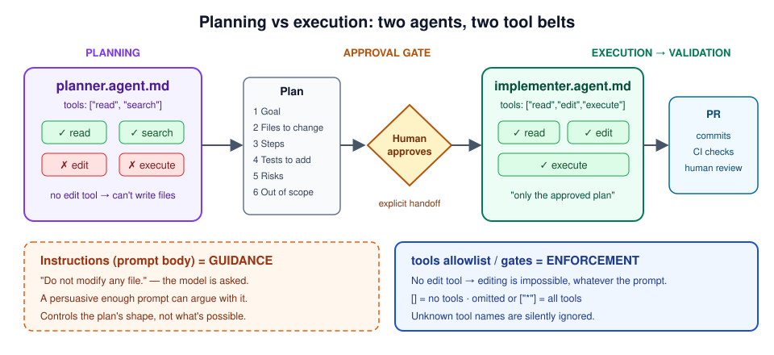

# Day 3 — The planner who can't pick up a pen

## Bets

- **Bet A** — What does `tools: []` do in an agent profile? **My guess: Disables all tools**
  - Result: **Hit** — actual: *Disables all tools* ([GitHub Docs](https://docs.github.com/en/copilot/reference/custom-agents-configuration#tools))
- **Bet B** — The read-only planner is told **"just fix it"**. What happens? **My guess: It says it can't, and returns a plan**
  - Result: _pending (Mission 6)_

## Lessons (Mission 1 — Anatomy of an agent profile)

- Profiles live in `.github/agents/NAME.agent.md`; the prompt body can be up to **30,000 characters** ([GitHub Docs](https://docs.github.com/en/copilot/reference/custom-agents-configuration))
- **Only `description` is required.** Optional: `name`, `target` (`vscode` / `github-copilot`, default both), `tools` (default all), `model`, `disable-model-invocation` (default `false`), `user-invocable` (default `true`), `mcp-servers`, `metadata` ([YAML frontmatter properties](https://docs.github.com/en/copilot/reference/custom-agents-configuration#yaml-frontmatter-properties))
- `infer` is **retired** → use `disable-model-invocation` **and** `user-invocable` *(correction: the plan names only `disable-model-invocation`)*
- `tools`: omitted or `["*"]` → all tools · a list → only those (unknown names silently ignored) · `[]` → **no tools** · MCP: `server/tool` or `server/*` ([Tools](https://docs.github.com/en/copilot/reference/custom-agents-configuration#tools))
- Aliases: `read` · `edit` · `search` · `execute` (`shell`/`Bash`/`powershell`) · `agent` · `web` · `todo` — **`web` and `todo` don't apply to the cloud agent** ([Tool aliases](https://docs.github.com/en/copilot/reference/custom-agents-configuration#tool-aliases))
- Mnemonic: **D-N-T-T-M + two switches** (Description, Name, Target, Tools, Model + `disable-model-invocation` / `user-invocable`)

## Why split planning from execution (Mission 2)

Source: [Learn — Separate planning, reasoning, and execution](https://learn.microsoft.com/en-us/training/modules/design-agent-architecture-integration/4-plan-reason-execution)

- **Planning** = what and why (PR description / issue comment) · **Execution** = concrete changes (commits) · **Validation** = evidence against success criteria (checks, scans, reviews)
- Four enforcement mechanisms: **read-only planning agent**, **explicit handoff** after approval, **tool gating** in orchestrators, **plan mode**
- Plan-first for high-risk work (workflows, infra, auth, production) → in this repo, any screening rule or threshold change

> "Treat 'instructions not to edit' as guidance; treat tool allowlists and gates as enforcement."

1. **Reviewable intent** — A plan shows *what* and *why* before any diff exists, so a reviewer checks the approach, not just the final code.
2. **Cheaper correction** — Fixing a wrong step in a plan costs a sentence; fixing it after execution costs a reverted PR and a rerun.
3. **Least privilege for the planning step** — Planning only needs `read` + `search`; without `edit`/`execute` the planner *can't* change anything, whatever the prompt says.

## Lessons (Mission 3 — The planner)

- `planner.agent.md` has `tools: ["read", "search"]` only: no `edit`, no `execute` → it **can't** write files or run commands (enforcement)
- The six-section plan shape and "do not modify any file" live in the prompt body → the model is **asked** (guidance)
- Twist: the docs' own *Implementation planner* example has `edit` so it can save plans as markdown. Mine can't write `plans/<issue>.md`, so tomorrow the plan has to reach the PR another way

## Lessons (Mission 4 — The implementer)

| Agent | Tools | Enforced by tools | Only asked by instructions |
|---|---|---|---|
| `planner` | `read`, `search` | Can't edit files or run commands | Six-section plan shape; "don't modify files" |
| `implementer` | `read`, `edit`, `execute` | — (it *can* edit any file) | Only the approved plan; only listed files; never `infra/` |

- The implementer's scope limits are **guidance**: `edit` works on any file. What catches drift is the plan-to-diff review in the PR, plus CI
- No `search` on purpose (per the plan); add it only if the agent struggles to find files

## Plan runs

Required shape: **Goal · Files to change · Steps (numbered) · Tests to add · Risks · Out of scope**

| Run | Task | Exact structure? | What drifted | Profile change |
|---|---|---|---|---|
| 1 | | | | |
| 2 | | | | |
| 3 | | | | |
